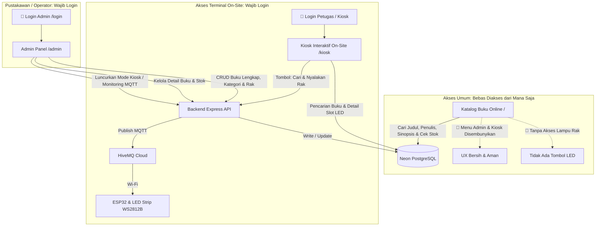
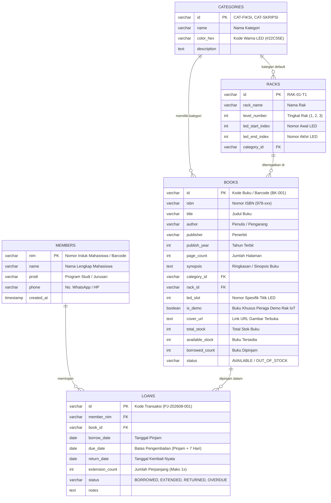
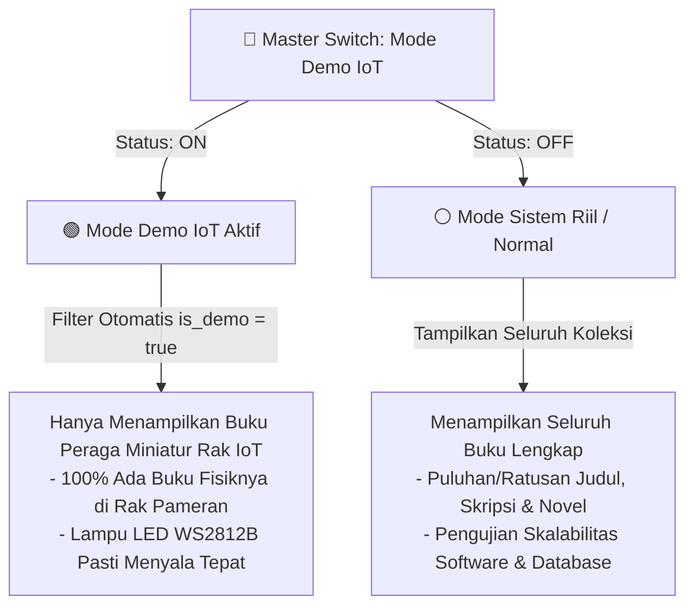

# 📚 DOKUMEN BLUEPRINT & SPESIFIKASI: FINDLIB UNSIKA
> **FindLib UNSIKA (Find your Library) - Universitas Singaperbangsa Karawang**  
> *Sistem Navigasi & Manajemen Perpustakaan Berbasis Web, IoT, dan Addressable LED WS2812B*  
> **Terakhir Diperbarui:** 7 September 2026

---

## 📌 1. Identitas & Visi Proyek

* **Nama Sistem:** **FindLib UNSIKA** (*Find your Library UNSIKA*)
* **Institusi:** Universitas Singaperbangsa Karawang (UNSIKA)
* **Karakteristik Utama:**
  1. **Pemisahan Antarmuka & Keamanan Ketat:** 
     * Halaman Publik (`/`) hanya menampilkan info buku umum & stok, bersih tanpa menu internal admin/kiosk agar tidak memancing *brute-force* atau keisengan publik.
     * Halaman Kiosk (`/kiosk`) dan Admin (`/admin`) **100% diproteksi autentikasi login**.
  2. **Navigasi Presisi (Dual-Stage LED):** Memandu pengunjung perpustakaan menemukan buku di rak fisik via indikator zona dan titik lampu LED spesifik (hanya dapat dipicu melalui Kiosk On-Site / Admin).
  3. **Detail Metadata Buku Lengkap:** Mendukung info komprehensif (ISBN, Penulis, Penerbit, Tahun Terbit, Jumlah Halaman, Sinopsis, Stok) untuk keperluan akademik & sirkulasi.
  4. **Desain UI/UX Elegan & Natural:** Tampilan bersih, profesional, modern bernuansa UNSIKA (Deep Navy Blue, Warm Amber/Gold, Tipografi Rapi, dan Halus), tidak berlebihan (*clean & sleek*).
  5. **Ramah Pemula & AI-Friendly:** Kode bersih (*Clean Code*), komentar berbahasa Indonesia, mudah di-maintenance, dan minim *build-step* rumit.

---

## 🏛️ 2. Arsitektur 3 Tampilan & Hak Akses



---

## 🔐 3. Kredensial Login Petugas / Admin
* **Halaman Login:** `/login` *(Akses tersembunyi, tidak ditampilkan di navbar publik)*
* **Username Default:** `admin`
* **Password Default:** `adminunsika` *(Dapat diubah di file `.env`)*

---

## 🗄️ 4. Struktur Database (Neon PostgreSQL)



---

## 🔄 5. Modul Peminjaman Buku & Data Mahasiswa

### A. Layout UI Dashboard Admin (Collapsible Sidebar Navigation):
Dashboard Admin dirancang menggunakan **Sidebar Samping Buka-Tutup (*Collapsible Sidebar*)**:
* **Tombol Toggle (☰):** Memungkinkan admin memperluas atau memperkecil sidebar agar area tabel data buku & peminjaman menjadi sangat lega.
* **Struktur Menu Sidebar:**
  1. 📚 **Koleksi Buku:** Kelola CRUD buku, tingkat rak, kategori, dan tes lampu LED.
  2. 🔄 **Peminjaman Buku:** Form pinjam kilat (*Auto-Fill NIM*), daftar buku yang sedang dipinjam, tombol perpanjang (+7 hari), dan tombol pengembalian buku.
  3. 🔴 **Buku Terlambat (Overdue):** Badge notifikasi angka merah dinamis di sidebar, tabel keterlambatan merah pekat, dan tombol langsung hubungi WhatsApp mahasiswa.
  4. 👥 **Data Mahasiswa:** Master data anggota (NIM, Nama, Prodi, No. WhatsApp) dengan fitur tambah, edit, dan hapus mahasiswa.
* **Footer Sidebar:** Indikator status koneksi Database Neon, Broker MQTT, dan tombol Logout.

---

### B. Skema Peminjaman & Otomasi:
* **Batas Waktu Standar:** **7 Hari (1 Minggu)** dari tanggal peminjaman.
* **Smart Auto-Fill:**
  * Admin ketik NIM mahasiswa di form peminjaman.
  * Jika NIM sudah ada di tabel `members` ➡️ Nama, Prodi, dan No. HP otomatis terisi.
  * Jika NIM belum ada (mahasiswa baru) ➡️ Form kilat untuk simpan ke tabel `members`.
* **Perpanjangan Waktu (Extend):**
  * Maksimal diperpanjang **1x (+7 hari lagi)** selama belum melewati tanggal jatuh tempo.
* **Indikator Keterlambatan (Daftar Warna Merah):**
  * 🟢 **Aman / Aktif:** `Hari Ini <= due_date` (Badge Hijau).
  * 🟡 **H-1 Jatuh Tempo:** `due_date - Hari Ini <= 1` (Badge Kuning).
  * 🔴 **TERLAMBAT (Overdue):** `Hari Ini > due_date` (Baris & Badge **MERAH PEKAT** + hitungan *"Terlambat X Hari"*).
* **Sinkronisasi Stok Otomatis:**
  * Saat Pinjam ➡️ `available_stock` - 1, `borrowed_count` + 1.
  * Saat Kembali ➡️ `available_stock` + 1, `borrowed_count` - 1, status transaksi = `RETURNED`.

---

## 📡 6. Protokol Komunikasi MQTT IoT

Topik MQTT: `libnav/unsika/rak/led`  
Broker: `broker.hivemq.com` (Port 1883)  
Payload JSON saat buku dicari:
```json
{
  "event": "LOCATE_BOOK",
  "book_id": "BK-001",
  "title": "Laut Bercerita",
  "rack_level": 1,
  "led_target": 3,
  "led_range": [1, 4],
  "color_hex": "#22C55E",
  "category": "Fiksi & Sastra",
  "action": "HIGHLIGHT",
  "duration_seconds": 15
}
```

---

## 💻 7. Spesifikasi Teknologi Software (*Tech Stack*)

| Lapisan / Komponen | Teknologi yang Digunakan | Penjelasan & Alasan Pemilihan |
| :--- | :--- | :--- |
| **Runtime Lingkungan** | **Node.js (v18.x / v20.x+)** | Lingkungan eksekusi JavaScript di sisi server yang cepat, non-blocking I/O, dan ringan. |
| **Backend Framework** | **Express.js (v4.19+)** | Web framework minimalis untuk routing REST API dan penyajian file statis (*static file serving*). |
| **Database Utama** | **PostgreSQL (Neon Serverless Cloud)** | Relational Database ACID-compliant via library `pg` (node-postgres) dengan SSL require. |
| **Database Fallback** | **JSON Local (`database/local_db.json`)** | Mekanisme *graceful degradation* jika koneksi internet terputus sehingga sistem tetap berfungsi offline. |
| **IoT & Messaging** | **MQTT.js (v5.5+)** | Library protokol publish/subscribe MQTT untuk komunikasi real-time antara server dan ESP32. |
| **Frontend Web** | **HTML5, CSS3 Modern, Vanilla JS (ES6+)** | Tanpa *framework build-step* (tidak perlu Webpack/Vite), cepat dimuat, mudah diedit, dan ramah pemula. |
| **Iconography & Fonts** | **Lucide Icons & Google Fonts (Inter)** | Tampilan modern, bersih (*clean*), dan tajam bernuansa institusi UNSIKA. |

---

## 🌐 8. Daftar Lengkap Endpoint Backend REST API

Seluruh endpoint backend didefinisikan secara modular di [`server.js`](./server.js):

### A. Autentikasi Petugas (`/api/auth`)
* `POST /api/auth/login` : Login admin (Body: `username`, `password`, `rememberMe`). Menghasilkan token sesi (24 Jam / 7 Hari).
* `GET /api/auth/verify` : Validasi token sesi admin (Header: `Authorization: Bearer <token>`).

### B. Status Sistem & Kategori (`/api/system-status`, `/api/categories`)
* `GET /api/system-status` : Ambil statistik total judul, stok fisik, buku dipinjam, status koneksi Database & MQTT.
* `GET /api/categories` : Ambil seluruh daftar kategori buku dan warna hex LED terkait.
* `POST /api/categories` : Tambah kategori baru beserta kode warna identitas rak.

### C. Rak & Lokasi LED (`/api/racks`)
* `GET /api/racks` : Ambil daftar tingkat rak (Level 1, 2, 3), kategori default, dan rentang index LED.

### D. Manajemen Data Buku (`/api/books`)
* `GET /api/books` : Ambil daftar buku (Mendukung filter search `?q=` dan kategori `?category=`).
* `GET /api/books/:id` : Ambil detail komprehensif 1 buku (metadata, stok, lokasi rak & slot LED).
* `POST /api/books` : Tambah data buku baru (Admin only).
* `PUT /api/books/:id` : Update data buku, stok, atau lokasi rak/LED (Admin only).
* `DELETE /api/books/:id` : Hapus data buku dari sistem (Admin only).

### E. Navigasi Pintar IoT (`/api/locate`)
* `POST /api/locate/:id` : Trigger MQTT ke ESP32 untuk menyalakan animasi LED spesifik pada rak buku target selama durasi tertentu.

### F. Manajemen Anggota Mahasiswa (`/api/members`)
* `GET /api/members` : Ambil daftar seluruh mahasiswa (Mendukung query `?q=` berdasarkan NIM, Nama, atau Prodi).
* `GET /api/members/:nim` : Ambil data spesifik mahasiswa untuk fitur *Smart Auto-Fill* form peminjaman.
* `POST /api/members` : Tambah atau update (*upsert*) data mahasiswa (NIM, Nama, Prodi, No. WhatsApp).
* `DELETE /api/members/:nim` : Hapus data mahasiswa (Admin only).

### G. Transaksi Peminjaman & Pengembalian (`/api/loans`)
* `GET /api/loans` : Ambil daftar transaksi sirkulasi (Filter: `?status=ACTIVE|OVERDUE|RETURNED` & `?q=`).
* `POST /api/loans` : Catat transaksi pinjam baru (Validasi batas maksimal buku, otomatis kurangi stok buku).
* `POST /api/loans/:id/extend` : Perpanjang waktu pengembalian buku (+7 hari, maks 1x perpanjangan).
* `POST /api/loans/:id/return` : Proses pengembalian buku (Otomatis kembalikan stok buku ke rak fisik).

### H. Pengaturan Sistem Perpustakaan (`/api/settings`)
* `GET /api/settings` : Ambil konfigurasi operasional (durasi pinjam, batas denda, template WhatsApp, durasi LED).
* `PUT /api/settings` : Update parameter konfigurasi perpustakaan secara dinamis.
* `POST /api/settings/reset` : Reset konfigurasi ke standar awal bawaan pabrik.
* `POST /api/settings/toggle-demo-mode` : Toggle cepat saklar global Mode Demo IoT (ON/OFF).

---

## 🔘 6. Fitur Dual Mode: Mode Demo IoT vs Mode Perpustakaan Riil (Capstone & Sidang)

Sistem FindLib UNSIKA dirancang dengan fleksibilitas tinggi untuk mengakomodasi **2 Skenario Pengujian**:



### 1. 🟢 Skenario 1: Demo Alat & Sidang Capstone (Mode Demo = ON)
* **Karakteristik:** Rak fisik demonstrasi adalah miniatur 3 tingkat dengan kapasitas LED terbatas (~15–30 titik) dan sampel buku fisik yang dibawa ke pameran/sidang terbatas (5–10 buku).
* **Perilaku Sistem:**
  * Endpoint `/api/books` otomatis memfilter hanya buku yang memiliki flag `is_demo = true`.
  * Antarmuka Kiosk (`/kiosk`), Portal Publik (`/`), dan Admin (`/admin`) hanya memuat buku-buku sampel peragaan.
  * **Manfaat:** Mencegah penguji/pengunjung mengklik buku yang tidak ada wujud fisiknya di miniatur rak. Setiap buku yang dicari di Kiosk dijamin ada di rak fisik dan lampu LED-nya menyala presisi.

### 2. ⚪ Skenario 2: Presentasi Software & Laporan Sistem (Mode Demo = OFF)
* **Karakteristik:** Memperlihatkan bahwa FindLib UNSIKA adalah sistem perpustakaan kampus riil yang siap produksi.
* **Perilaku Sistem:**
  * Menampilkan seluruh koleksi lengkap buku (ratusan judul, skripsi mahasiswa, novel, referensi, sirkulasi peminjaman, data anggota).
  * Menunjukkan kekuatan pencarian, manajemen stok, dan laporan sirkulasi menyeluruh.

---

## 📁 9. Struktur Direktori & Modul File Software

```
libnav-unsika/
├── public/                     # Frontend Web (Client-Side)
│   ├── images/                 # Logo UNSIKA & aset visual
│   │   └── unsika.png
│   ├── index.html              # 🌐 Portal Publik Katalog Buku Online
│   ├── kiosk.html              # 📍 Terminal Kiosk On-Site Perpustakaan (Navigasi LED)
│   ├── admin.html              # ⚙️ Dashboard Admin (Sirkulasi, Data Buku & Mahasiswa)
│   ├── login.html              # 🔐 Halaman Login Khusus Petugas
│   ├── css/
│   │   └── style.css           # Styling terpadu (UNSIKA Theme, Responsive, Modal, Animasi)
│   └── js/
│       ├── public-app.js       # Logika Frontend Katalog Publik
│       ├── kiosk-app.js        # Logika Frontend Kiosk & Visualisator Rak Interaktif
│       └── admin-app.js        # Logika Frontend Admin Panel (Auth Guard & State Manager)
├── database/                   # Skema & Fallback Data
│   ├── schema.sql              # Definisi Tabel PostgreSQL (DDL)
│   ├── seed.sql                # Data Sampel Awal Buku, Rak, dan Mahasiswa
│   └── local_db.json           # Fallback Database Offline (JSON)
├── server.js                   # 🚀 Backend Utama: REST API, Koneksi PostgreSQL & MQTT Broker
├── .env                        # Konfigurasi Lingkungan (Database URL, Broker, Port, Kredensial)
├── .env.example                # Contoh Template Konfigurasi untuk Deployment / Tim
├── package.json                # Metadata & Daftar Dependensi Node.js
├── PROJECT_BLUEPRINT.md        # 📚 Dokumen Blueprint & Spesifikasi Lengkap Ini
├── PANDUAN_SETUP_DAN_PROMPT.md # 📘 Panduan Pengoperasian & Template Prompt AI
└── README.md                   # 📄 Ringkasan Proyek & Cara Menjalankan Cepat
```

